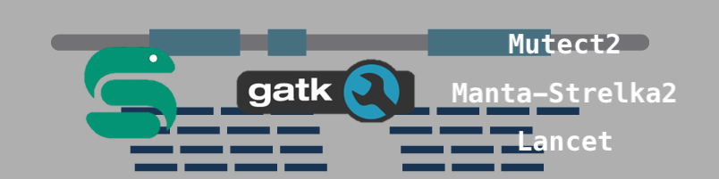

[![LinkedIn][linkedin-shield]][linkedin-url]

<!-- PROJECT LOGO -->
 

  
  <h3 align="center"> Whole exome somatic variant calling in Snakemake</h3>

  

    Mutect2 - Strelka2 - Lancet
     

<!-- TABLE OF CONTENTS -->

  
Table of Contents

  <ol>
    <li>
      <a href="#about">About</a></li>
    <li>
      <a href="#pipeline-structure">Pipeline structure</a>
    </li>
    <li>
      <a href="#prerequisites">Prerequisites</a>
    </li>
    <li><a href="#usage">Usage</a></li>
    <li><a href="#contact">Contact</a></li>
    <li><a href="#acknowledgments">Acknowledgments</a></li>
  </ol>

<!-- ABOUT THE PROJECT -->
## About

This Snakemake based pipeline follows GATK best practices to produce analysis ready BAM files and runs conventional variant callers to produce annotated MAF files which are ready for further analyses. It is configurable to run in a map only mode which allows use of your variant caller of choice. Reference files will need to be downloaded and configured for specific components of the pipeline. 

(<a href="#readme-top">back to top</a>)

<!-- PIPELINE STRUCTURE -->
## Pipeline structure
Map-only mode

1. QC: [FastQC](https://github.com/s-andrews/FastQC)
2. Trimming: [Trim Galore](https://github.com/FelixKrueger/TrimGalore)
3. Mapping: [bwa mem](https://github.com/lh3/bwa)
4. Mark duplicates: [picard MarkDuplicates](https://gatk.broadinstitute.org/hc/en-us/articles/360037052812-MarkDuplicates-Picard)
5. Base recalibration: [BaseRecalibrator](https://gatk.broadinstitute.org/hc/en-us/articles/360036898312-BaseRecalibrator) and [ApplyBQSR](https://gatk.broadinstitute.org/hc/en-us/articles/360037055712-ApplyBQSR)
6. Generate bam index files: [samtools index](http://www.htslib.org/doc/samtools-index.html)
7. [MultiQC](https://github.com/ewels/MultiQC)

Somatic variant calling mode

1. QC: [FastQC](https://github.com/s-andrews/FastQC)
2. Trimming: [Trim Galore](https://github.com/FelixKrueger/TrimGalore)
3. Mapping: [bwa mem](https://github.com/lh3/bwa)
4. Mark duplicates: [picard MarkDuplicates](https://gatk.broadinstitute.org/hc/en-us/articles/360037052812-MarkDuplicates-Picard)
5. Base recalibration: [BaseRecalibrator](https://gatk.broadinstitute.org/hc/en-us/articles/360036898312-BaseRecalibrator) and [ApplyBQSR](https://gatk.broadinstitute.org/hc/en-us/articles/360037055712-ApplyBQSR)
6. Generate bam index files: [samtools index](http://www.htslib.org/doc/samtools-index.html)
7. Variant calling: [Mutect2](https://gatk.broadinstitute.org/hc/en-us/articles/360037593851-Mutect2), [Manta](https://github.com/Illumina/manta) → [Strelka2](https://github.com/Illumina/strelka), [Lancet](https://github.com/nygenome/lancet)
8. Mutect filtering steps: [GetPileupSummaries](https://gatk.broadinstitute.org/hc/en-us/articles/360037593451-GetPileupSummaries),
[LearnReadOrientationModel](https://gatk.broadinstitute.org/hc/en-us/articles/360051305331-LearnReadOrientationModel),
[CalculateContamination](https://gatk.broadinstitute.org/hc/en-us/articles/360036888972-CalculateContamination),
[FilterMutectCalls](https://gatk.broadinstitute.org/hc/en-us/articles/360036856831-FilterMutectCalls)
9. PASS filtering on separate VCFs from all 3 callers
10. Removal of FFPE artifacts: [SOBDetector](https://github.com/mikdio/SOBDetector)
11. Annotation using VEP backend: [vcf2maf](https://github.com/mskcc/vcf2maf)

(<a href="#readme-top">back to top</a>)

<!-- PREREQUISITES -->
## Prerequisites

* The associated docker image can be pulled from Docker Hub
~~~
docker pull kennethchow/bioinformatics:ubuntu_wes_variantcalling
~~~
* A human reference [genome](https://storage.cloud.google.com/genomics-public-data/resources/broad/hg38/v0/Homo_sapiens_assembly38.fasta)
* gnomAD reference [vcfs](https://drive.google.com/drive/folders/1MwkBJlP_z-Mh1C8AEOowc0K-r2ZJ2bTu?usp=sharing)
* VEP annotation [files](https://ftp.ensembl.org/pub/release-111/variation/vep/homo_sapiens_merged_vep_111_GRCh38.tar.gz)
* Your custom .bed file target intervals

(<a href="#readme-top">back to top</a>)

<!-- USAGE -->
## Usage

The cloned repository folder can act as a functional working directory.

Run the prepare script which creates necessary directories and generates symbolic links to raw data input files. 
~~~
bash prepare.sh path/to/raw/data/directory/
~~~

Generate the samples.tsv which contains 3 columns:
1. sample fastqs: raw list of fastq file names, generated by the prepare.sh script
2. raw sample type: mapped from handling metadata which contains the associated sample type
3. tumor normal: contains 2 possible values, tumor or normal. These are key value labels used for downstream processing. Use column 2 to map these values.

| sample_fastqs        | sample_type  | tumor_normal |
|----------------------|--------------|--------------|
| x123_AAAA_1.fq.gz    | whole blood  | normal       |
| x123_AAAA_2.fq.gz    | whole blood  | normal       |
| x123_T1_AAAA_1.fq.gz | tumor tissue | tumor        |
| x123_T1_AAAA_2.fq.gz | tumor tissue | tumor        |

Configure parameters in config.yaml
* Key parameters to set:
    * mode: Either 'map_only' or 'somatic'
    * samples: samples.tsv file
    * data_dir: raw data directory
    * result_dir: premade results directory
    * java_tmp_dir: define a tmp dir for intermediary processing files
    * bwa_index: set a directory for bwa_index if one already exists, pipeline will generate one using the provided genome fasta if missing.
    * genome_fasta: path to human reference genome
    * references-known_variants-gnomad: gnomad reference path
    * references-known_variants-vep: vep annotation files path
    * references-bed: target bed file

Ensure you are in the root of the working directory and run a snakemake dry-run to verify correct inputs and outputs.
~~~
docker run --rm kennethchow/bioinformatics:ubuntu_wes_variantcalling bash -c "snakemake -n --debug-dag"
~~~
Run a full pass.
~~~
docker run --rm kennethchow/bioinformatics:ubuntu_wes_variantcalling bash -c "snakemake --cores 16 --retries 3 --rerun-incomplete --jobs 5"
~~~
The flags used in this example are all optional and customizable to your own purposes. The retries flag is there to activate the oom handling feature in snakemake, most memory intensive rules in this pipeline are configured to rerun with more memory contingent upon an OOM job failure. Rerun incomplete makes sure that jobs that failed before completion are re-run. Finally, the jobs flag controls the number of concurrent running jobs, a more manual resource management flag. 

(<a href="#readme-top">back to top</a>)

<!-- CONTACT -->
## Contact

Kenneth Chow - kennethchowsk@gmail.com

Project Link: [https://github.com/kennethchow/snakemake-wes-variant-calling](https://github.com/kennethchow/snakemake-wes-variant-calling)

(<a href="#readme-top">back to top</a>)

<!-- MARKDOWN LINKS & IMAGES -->

[linkedin-shield]: https://img.shields.io/badge/-LinkedIn-black.svg?style=for-the-badge&logo=linkedin&colorB=555
[linkedin-url]: https://linkedin.com/in/kenneth-chow